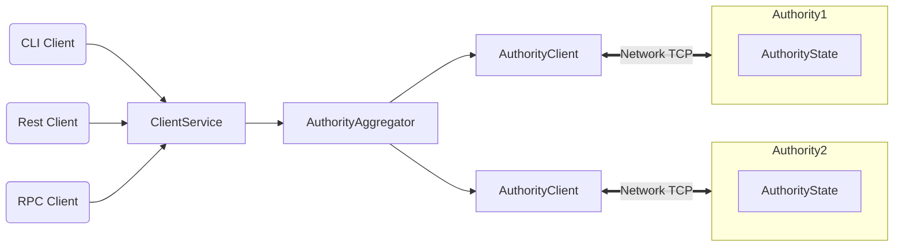

# OneChain

[OneChain](https://onelabs.cc) is poised to redefine the future of financial services through blockchain technology, building a next-generation financial infrastructure that serves everyone.

## OneChain Highlights

OneChain offers the following benefits and capabilities:

 * Near Instantaneous Transaction Confirmation
 * Developer-Centric Ecosystem
 * Seamless and User-Friendly Blockchain Access
 * Yield-Generating Stablecoin 
 * Digitization and Tokenization of Real-World Assets
 * Collaborative Node Ecosystem
 * Top-Tier Security : MPC + Decentralized Governance
 * Extensible and Scalable Ecosystem for Real-World Applications
 * Modular Configurable Privacy Controls

OneChain is more than just a technologically advanced public chain — it’s a sustainable, co-built ecosystem. With exceptional transaction performance, user-friendly design, developer support, the ability to tokenize real-world assets, and comprehensive security and privacy protections, OneChain empowers users to control their assets, institutions to unlock real liquidity, and developers to launch products swiftly. Every participant has the chance to be both a builder and a beneficiary of this ecosystem.

OneChain is ushering blockchain into an era of being “useful and easy to use.” Whether you’re a developer, enterprise, institution, or everyday user, we invite you to join the OneChain ecosystem and help shape an open, trustworthy, and sustainable digital future.

## OneChain Architecture

## OneChain Overview

OneChain is written in [Rust](https://www.rust-lang.org) and supports smart contracts written in the [Move programming language](https://github.com/move-language/move) to define assets that may have an owner. Move programs define operations on these assets including custom rules for their creation, the transfer of these assets to new owners, and operations that mutate assets.

OneChain has a native token called OCT, with a fixed supply. The OCT token is used to pay for gas, and is also used as [delegated stake on authorities](https://learn.bybit.com/blockchain/delegated-proof-of-stake-dpos/) within an epoch. The voting power of authorities within this epoch is a function of this delegated stake. Authorities are periodically reconfigured according to the stake delegated to them. In any epoch, the set of authorities is [Byzantine fault tolerant](https://pmg.csail.mit.edu/papers/osdi99.pdf). At the end of the epoch, fees collected through all transactions processed are distributed to authorities according to their contribution to the operation of the system. Authorities can in turn share some of the fees as rewards to users that delegated stakes to them.

## More About OneChain

Use the following links to learn more about OneChain and the OneChain ecosystem:

 * Learn more about working with OneChain in the [📔 Blog](https://onechain.medium.com).
 * Join the OneChain community on [💬 Telegram](https://t.me/hello_onechain).
 * Find out more about the OneChain ecosystem on the [🌐 Website](https://onelabs.cc) page.
